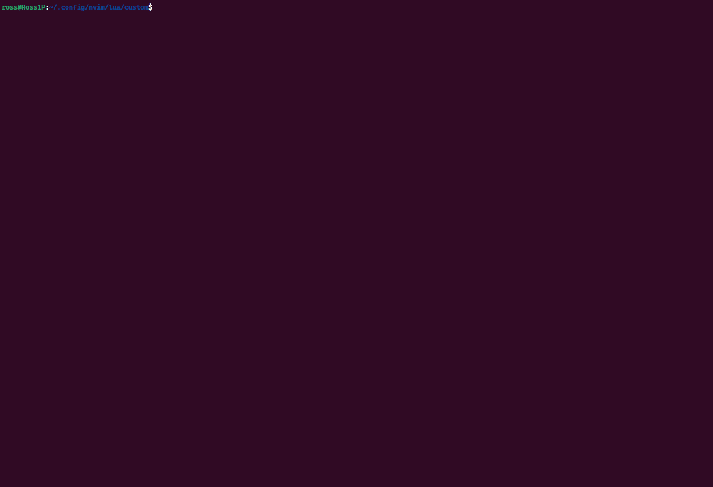

# dimit.nvim
A neovim plugin to dim inactive windows (change their background color). 

It is mainly a rewrite of jceb/blinds.nvim, which uses lua and makes configuration easier, and works with package manager.



# Installation
- Install it with packer (or any other package manager)
```lua
use {
    "rosstang/dimit.nvim",
    config = function()
        require("dimit").setup()
    end,
}
```

# Configuration
- default config
```lua
M.config = {
    bgcolor = "#303030",
    highlight_group = "Dimit",
    auto_dim = true,
    dim_elements = {
        "ColorColumn",
        "CursorColumn",
        "CursorLine",
        "CursorLineFold",
        "CursorLineNr",
        "CursorLineSign",
        "EndOfBuffer",
        "FoldColumn",
        "LineNr",
        "NonText",
        "Normal",
        "SignColumn",
        "VertSplit",
        "Whitespace",
        "WinBarNC",
        "WinSeparator",
    },
}
```

- setup() can be called multiple times to change configuration,
```lua
require("dimit").setup({
    bgcolor = "#FF0000",         -- change the dim color to red
})
```

- In case the current windows is also dimmed (not undimmed), you can call :Dimit to redo the dimming.

